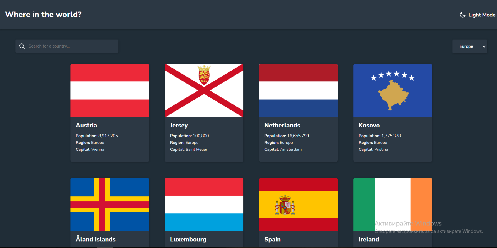

<h1 align="center">
 REST Countries App
</h1>

<p>REST Countries API with color theme switcher made with React and TypeScript</p>



## 🚀 Demo
<a href='https://restcountries-nine.vercel.app/'>restcountries-nine.vercel.app</a>

## 🛠️ Installation Steps

1. Clone the repository

```bash
git clone https://github.com/SDdev2017/restcountries.git
```

2. Change the working directory

```bash
cd project
```

3. Install dependencies

```bash
npm install
```

4. Run the app

```bash
npm start
```

## 💻 Built with

- ReactJS
- Sass
- TypeScript
- Create React App API
- [REST Countries](https://restcountries.com/): REST Countries API
